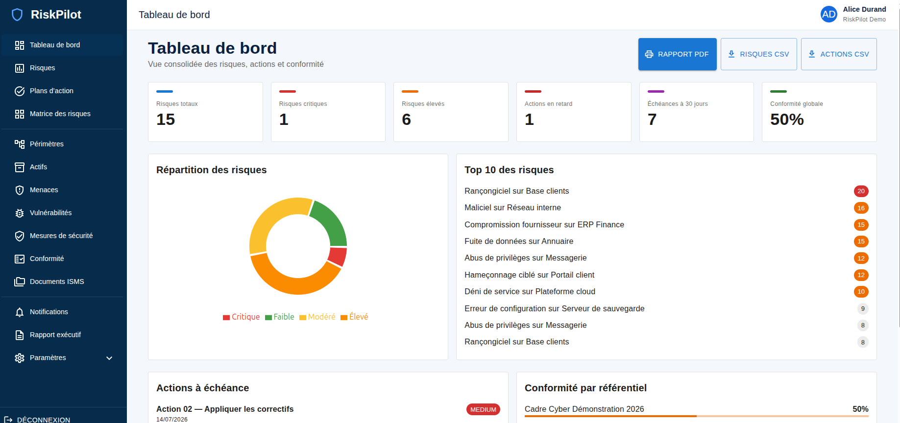

# RiskPilot

RiskPilot est une plateforme GRC open source pour gérer les risques cyber, la conformité, les plans d’action et la documentation ISMS. Elle comprend l’isolation multi-tenant, le RBAC, le MFA TOTP, les notifications, la messagerie SMTP/OAuth 2.0, les tableaux de bord, les exports CSV et le rapport exécutif imprimable.



## Prérequis

- Docker 24+ avec Docker Compose v2
- GNU Make
- Ports `8080` (application) et `8025` (Mailpit) disponibles

PHP, Composer, Node et PostgreSQL n’ont pas besoin d’être installés sur l’hôte.

## Installation

```bash
cp .env.example .env
make install
make start
```

L’application est disponible sur <http://localhost:8080>, l’API sur <http://localhost:8080/api> et Mailpit sur <http://localhost:8025>.

Chargez facultativement le jeu de démonstration reproductible :

```bash
make fixtures
```

Cette commande remplace les données de la base courante. Pour une base vide sans démonstration, créez le premier administrateur :

```bash
docker compose exec backend php bin/console app:user:create-admin \
  "Mon organisation" admin@example.com "un-mot-de-passe-robuste"
```

## Commandes

`make start`, `make stop`, `make restart`, `make logs`, `make migrate`, `make fixtures`, `make test`, `make lint`, `make shell-backend`, `make shell-frontend` et `make reset` couvrent le cycle de développement courant.

## Structure

- `backend/` : API Symfony, organisée en couches Domain, Application, Infrastructure et Api.
- `frontend/` : SPA React, TypeScript, Vite et Material UI.
- `docker/` : configuration Nginx et infrastructure locale.
- `docs/` : architecture, sécurité, données, API, déploiement et développement. Commencez par le [guide d’architecture](docs/architecture.md) pour comprendre les composants et leurs flux.

La [roadmap](docs/roadmap.md) maintient les écarts restants et leur ordre de priorité avant une exploitation critique.

## Authentification et administration

La connexion JWT est disponible sur `POST /api/auth/login`. Les jetons expirent après 15 minutes et les tentatives sont limitées. `GET /api/me` retourne le profil courant. Chaque utilisateur peut activer un MFA TOTP compatible Google Authenticator et Microsoft Authenticator depuis **Paramètres → Mon profil et MFA**, avec QR code et codes de secours à usage unique. Les administrateurs gèrent les utilisateurs de leur organisation ; seuls les super-administrateurs peuvent gérer plusieurs organisations.

La navigation est responsive : tiroir mobile sous `md`, barre latérale repliable sur ordinateur et sous-menu **Paramètres** regroupant profil/MFA, messagerie, utilisateurs, organisations et audit selon les droits.

## Messagerie SMTP et OAuth 2.0

Dans **Paramètres → Messagerie**, un administrateur configure la messagerie de son organisation :

- SMTP2GO ou un serveur SMTP personnalisé avec STARTTLS/TLS ;
- Google Workspace via OAuth 2.0 et Gmail API (`gmail.send`) ;
- Microsoft 365 via OAuth 2.0 et Microsoft Graph (`Mail.Send`).

Les mots de passe SMTP, secrets clients et jetons OAuth sont chiffrés avec libsodium. Ils ne sont jamais retournés par l’API ni écrits dans le journal d’audit. Les jetons OAuth sont renouvelés automatiquement. Pour Google ou Microsoft, créez une application Web chez le fournisseur, recopiez le Client ID et le secret dans RiskPilot, déclarez l’URI de callback affichée puis cliquez sur **Connecter le compte**.

`APP_URL` doit correspondre exactement à l’URL publique, par exemple `https://grc.example.com`. Cette valeur est utilisée pour les callbacks OAuth ; elle doit donc utiliser HTTPS en production et correspondre aux URI enregistrées dans Google Cloud et Microsoft Entra.

Les écrans `/scopes`, `/assets`, `/threats`, `/vulnerabilities` et `/security-controls` donnent accès à l’inventaire de l’organisation. Le registre `/risks` présente les scores brut, actuel et résiduel. La matrice interactive `/risk-matrix` restitue ces évaluations sur une grille 5 × 5 selon les seuils configurés par organisation. Les API associées permettent la création et la modification aux Risk Managers et administrateurs, avec contrôle systématique des relations entre tenants.

## Moteur de risque

Un scénario associe un périmètre, un actif, une menace, des vulnérabilités, des mesures de sécurité et un responsable. Chaque évaluation utilise une vraisemblance et un impact de 1 à 5 ; le score est leur produit. Les seuils par défaut sont faible jusqu’à 4, modéré jusqu’à 9, élevé jusqu’à 16 et critique au-delà. Ils sont personnalisables sur l’organisation.

Les principales API sont `GET|POST /api/risks`, `GET|PUT /api/risks/{id}`, `GET|POST /api/security-controls`, `GET|PUT /api/security-controls/{id}` et `GET /api/risk-matrix?scoreType=current`.

## Plans d’action et notifications

L’écran `/actions` propose les vues tableau, Kanban et calendrier. Une action est associée à un risque, éventuellement à une mesure de sécurité, et suit son responsable, sa priorité, ses dates, sa progression, ses coûts, la réduction de risque attendue, ses preuves et ses commentaires. Le statut `OVERDUE` est calculé automatiquement lorsque l’échéance est dépassée.

Les affectations, changements de responsable et alertes d’échéance produisent une notification dans `/notifications` et un email asynchrone traité par Symfony Messenger. La commande suivante génère les alertes d’échéance :

```bash
docker compose exec backend php bin/console app:actions:notify-deadlines
```

Les API principales sont `GET|POST /api/actions`, `GET|PUT /api/actions/{id}`, `GET|POST /api/actions/{id}/comments`, `GET /api/notifications` et `PUT /api/notifications/{id}/read`.

## Référentiels et conformité

L’écran `/compliance` regroupe les référentiels et les évaluations. Une évaluation porte sur un périmètre et génère un résultat pour chaque exigence active. Les évaluateurs saisissent un niveau de maturité de 0 à 5, un statut conforme, partiel, non conforme, non applicable ou non évalué, ainsi que des preuves et une action corrective facultative. Le score global exclut les exigences non applicables ou non évaluées.

Les API principales sont `GET|POST /api/frameworks`, `GET|POST /api/frameworks/{id}/requirements`, `GET|POST /api/compliance-assessments`, `GET /api/compliance-assessments/{id}/results` et `PUT /api/compliance-results/{id}`.

## Documents ISMS

Le menu **Documents ISMS** centralise les politiques, procédures, instructions, preuves, registres et modèles. Chaque document possède un propriétaire, une classification, une visibilité organisation ou restreinte, un statut et un historique de versions immuables. Les ACL nominatives distinguent lecture, édition et administration.

La vue d’ensemble présente au maximum les 10 documents accessibles les plus récemment mis à jour, toutes catégories confondues. Les catégories utilisées par les documents deviennent automatiquement des sous-menus ; elles sont calculées après filtrage ACL et tenant, afin de ne jamais révéler une catégorie privée. Le formulaire accepte une catégorie existante ou la création directe d’un nouveau libellé.

Un document naît en brouillon, peut être soumis à revue puis approuvé par un gestionnaire avec identité du valideur et date de prochaine revue. Toute modification ultérieure du contenu ou du fichier invalide automatiquement l’approbation. L’interface signale les revues arrivées à échéance.

Un gestionnaire peut créer un lien externe révocable et expirable. Les documents confidentiels ou restreints exigent un mot de passe ; un partage restreint expire obligatoirement sous 30 jours. RiskPilot ne stocke que les empreintes du jeton et du mot de passe ; le lien complet n’est affiché qu’à sa création.

Les ACL nominatives appliquent strictement `READ`, `EDIT` et `MANAGE`. Seuls les comptes actifs de l’organisation peuvent être propriétaires ou recevoir une ACL. Un partage public n’est possible que sur une version approuvée ; toute modification révoque définitivement les liens existants afin qu’une approbation ultérieure ne les réactive pas.

Un document peut contenir du Markdown, un fichier Word `.doc`/`.docx`, ou les deux. Les fichiers Word sont contrôlés côté serveur, limités à 10 Mo, protégés contre les archives décompressées excessives et conservés dans un volume Docker privé. Chaque changement crée une version et enregistre l’empreinte SHA-256 de la pièce jointe. Le stockage chiffré S3/MinIO et l’antivirus restent planifiés dans la [roadmap documentaire](docs/isms-documents-roadmap.md).

## Tableau de bord, exports et démonstration

Le tableau de bord consolide les risques par niveau, les actions proches de leur échéance et la conformité par référentiel. Les boutons d’export produisent des fichiers CSV UTF-8 pour le registre des risques, les plans d’action et une évaluation de conformité, toujours limités à l’organisation courante.

Les fixtures créent une organisation, trois utilisateurs, plusieurs périmètres, 10 actifs, 10 menaces, 10 vulnérabilités, 15 risques, 20 actions et une évaluation d’un référentiel générique. Elles sont réservées au développement :

- `admin@riskpilot.local` / `ChangeMe123!` ;
- `risk.manager@riskpilot.local` / `ChangeMe123!` ;
- `action.owner@riskpilot.local` / `ChangeMe123!`.

Le compte administrateur est super-administrateur. Depuis l’interface, il peut créer et modifier les utilisateurs et organisations, gérer les inventaires, risques, actions et évaluations, archiver ou désactiver les ressources importantes, et consulter le journal d’audit. Le rôle « Lecteur » hérité pour l’autorisation interne n’est pas présenté comme rôle assigné.

## Tests

Après démarrage :

```bash
make test
make lint
curl http://localhost:8080/api/health
```

## Reverse proxy HTTPS séparé

Docker reste volontairement en HTTP sur le port `8080`. Aucun certificat, port `443` ou redirection HTTP vers HTTPS n’est intégré aux fichiers Compose. Le compose de production utilise uniquement [docker/nginx/production-http.conf](docker/nginx/production-http.conf).

Pour exposer RiskPilot en HTTPS, installez Nginx séparément sur l’hôte ou sur un reverse proxy :

1. copiez `nginx.conf.example` dans la configuration du Nginx hôte ;
2. remplacez le domaine et les chemins des certificats ;
3. gardez RiskPilot accessible localement sur `127.0.0.1:8080` ;
4. définissez `APP_ENV=prod`, `APP_DEBUG=0` et `APP_URL=https://votre-domaine` dans `.env`.

```bash
docker compose -f compose.yaml -f compose.prod.yaml up -d --build
docker compose exec backend php bin/console doctrine:migrations:migrate --no-interaction
```

Le fichier autonome [nginx.conf.example](nginx.conf.example) redirige HTTP vers HTTPS, active TLS 1.2/1.3 et HSTS, puis relaie l’ensemble vers le port HTTP Docker `8080`. Les en-têtes transmis préservent les callbacks OAuth Google et Microsoft. Nginx ne relaie pas SMTP : SMTP2GO sort directement du backend, tandis que Google et Microsoft utilisent leurs API HTTPS.

## Limitations connues

Le renouvellement/révocation centralisée des sessions JWT, la récupération de compte, le stockage externe chiffré des pièces jointes, l’audit probant, les sauvegardes automatisées et l’observabilité de production restent à intégrer avant une exploitation critique. La [roadmap](docs/roadmap.md) détaille également les écarts fonctionnels GRC : acceptation des risques, SoA, tiers, incidents, continuité et programme d’audit.

Licence : AGPL-3.0-or-later.
