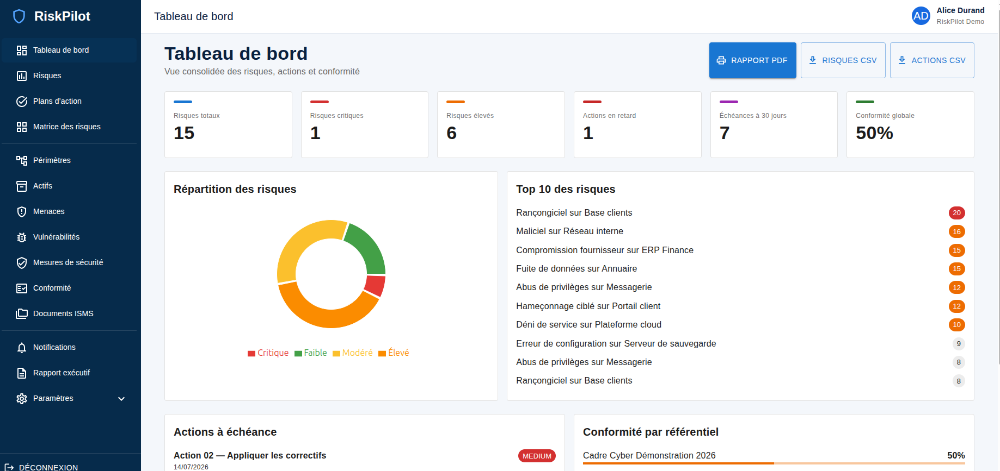

# RiskPilot

RiskPilot est une plateforme GRC open source pour gérer les risques cyber, la conformité, les plans d’action, les audits, les tiers, la résilience et la documentation ISMS. Elle comprend l’isolation multi-tenant, le RBAC, le MFA TOTP, les notifications, la messagerie SMTP/OAuth 2.0, les tableaux de bord, les exports, les rapports annuels versionnés et un radar de maturité cyber de 0 à 5.



## Prérequis

- Docker 24+ avec Docker Compose v2
- GNU Make
- Ports `8080` (application) et `8025` (Mailpit) disponibles

PHP, Composer, Node et PostgreSQL n’ont pas besoin d’être installés sur l’hôte.

## Installation

```bash
cp .env.example .env
make install
make start
```

L’application est disponible sur <http://localhost:8080>, l’API sur <http://localhost:8080/api> et Mailpit sur <http://localhost:8025>.

Chargez facultativement le jeu de démonstration reproductible :

```bash
make fixtures
```

Cette commande remplace les données de la base courante. Pour une base vide sans démonstration, créez le premier administrateur :

```bash
docker compose exec backend php bin/console app:user:create-admin \
  "Mon organisation" admin@example.com "un-mot-de-passe-robuste"
```

## Commandes

`make start`, `make stop`, `make restart`, `make logs`, `make migrate`, `make fixtures`, `make test`, `make lint`, `make shell-backend`, `make shell-frontend` et `make reset` couvrent le cycle de développement courant.

## Structure

- `backend/` : API Symfony, organisée en couches Domain, Application, Infrastructure et Api.
- `frontend/` : SPA React, TypeScript, Vite et Material UI.
- `docker/` : configuration Nginx et infrastructure locale.
- `docs/` : architecture, sécurité, données, API, déploiement et développement. Commencez par le [guide d’architecture](docs/architecture.md) pour comprendre les composants et leurs flux.

La [roadmap](docs/roadmap.md) maintient les écarts restants et leur ordre de priorité avant une exploitation critique.

## Authentification et administration

La connexion JWT est disponible sur `POST /api/auth/login`. Les jetons expirent après 15 minutes et les tentatives sont limitées. `GET /api/me` retourne le profil courant. Chaque utilisateur peut activer un MFA TOTP compatible Google Authenticator et Microsoft Authenticator depuis **Paramètres → Mon profil et MFA**, avec QR code et codes de secours à usage unique. Les administrateurs gèrent les utilisateurs de leur organisation ; seuls les super-administrateurs peuvent gérer plusieurs organisations.

La navigation est responsive : tiroir mobile sous `md`, barre latérale repliable sur ordinateur et sous-menu **Paramètres** regroupant profil/MFA, messagerie, utilisateurs, organisations et audit selon les droits.

## Messagerie SMTP et OAuth 2.0

Dans **Paramètres → Messagerie**, un administrateur configure la messagerie de son organisation :

- SMTP2GO ou un serveur SMTP personnalisé avec STARTTLS/TLS ;
- Google Workspace via OAuth 2.0 et Gmail API (`gmail.send`) ;
- Microsoft 365 via OAuth 2.0 et Microsoft Graph (`Mail.Send`).

Les mots de passe SMTP, secrets clients et jetons OAuth sont chiffrés avec libsodium. Ils ne sont jamais retournés par l’API ni écrits dans le journal d’audit. Les jetons OAuth sont renouvelés automatiquement. Pour Google ou Microsoft, créez une application Web chez le fournisseur, recopiez le Client ID et le secret dans RiskPilot, déclarez l’URI de callback affichée puis cliquez sur **Connecter le compte**.

`APP_URL` doit correspondre exactement à l’URL publique, par exemple `https://grc.example.com`. Cette valeur est utilisée pour les callbacks OAuth ; elle doit donc utiliser HTTPS en production et correspondre aux URI enregistrées dans Google Cloud et Microsoft Entra.

Depuis la vue Calendrier des plans d’action, chaque utilisateur peut créer un lien d’abonnement iCalendar privé compatible Apple Calendar/iOS, Google Calendar/Android et Outlook. Le flux contient uniquement ses actions affectées ; le lien est affiché une seule fois et peut être régénéré ou révoqué à tout moment.

L’authentification utilise des JWT courts liés à une session serveur et un refresh token rotatif conservé en cookie HttpOnly. Le profil permet de consulter et révoquer les appareils connectés. Le parcours « Mot de passe oublié » envoie un lien à usage unique valable 30 minutes et invalide toutes les sessions après réinitialisation. Après plusieurs échecs, le compte est temporairement verrouillé de manière progressive. Le MFA reste facultatif conformément au périmètre produit.

Les écrans `/scopes`, `/assets`, `/threats`, `/vulnerabilities` et `/security-controls` donnent accès à l’inventaire de l’organisation. Le registre `/risks` présente les scores brut, actuel et résiduel ainsi que la gouvernance : appétence/tolérance/capacité par domaine et famille, scénarios stratégiques, méthodes simplifiée, ISO 27005 ou EBIOS RM, recommandations selon coût/charge/réduction, acceptations formelles et campagnes de revue historisées. La matrice interactive `/risk-matrix` restitue ces évaluations sur une grille 5 × 5 selon les seuils configurés par organisation. Les API associées contrôlent systématiquement les rôles et relations entre tenants.

L'espace `/ebios` matérialise les cinq ateliers EBIOS RM : cadrage et socle,
sources de risque, scénarios stratégiques, scénarios opérationnels et traitement.
Chaque atelier est persisté, versionné, contrôlé selon ses champs obligatoires et
validé par une personne distincte de son dernier rédacteur. Les ateliers doivent
être validés dans l'ordre.

## Moteur de risque

Un scénario associe un périmètre, un actif, une menace, des vulnérabilités, des mesures de sécurité et un responsable. Chaque évaluation utilise une vraisemblance et un impact de 1 à 5 ; le score est leur produit. Les seuils par défaut sont faible jusqu’à 4, modéré jusqu’à 9, élevé jusqu’à 16 et critique au-delà. Ils sont personnalisables sur l’organisation.

Les principales API sont `GET|POST /api/risks`, `GET|PUT /api/risks/{id}`, `GET|POST /api/security-controls`, `GET|PUT /api/security-controls/{id}`, `GET /api/risk-matrix?scoreType=current` et les parcours `/api/risk-governance/{policies,recommendations,portfolio,acceptances,campaigns}`.

## Plans d’action et notifications

L’écran `/actions` propose les vues tableau, Kanban et calendrier. Une action est associée à un risque, éventuellement à une mesure de sécurité, et suit son responsable, sa priorité, ses dates, sa progression, ses coûts, la réduction de risque attendue, ses preuves et ses commentaires. Le statut `OVERDUE` est calculé automatiquement lorsque l’échéance est dépassée.

Les affectations, changements de responsable et alertes d’échéance produisent une notification dans `/notifications` et un email asynchrone traité par Symfony Messenger. La commande suivante génère les alertes d’échéance :

```bash
docker compose exec backend php bin/console app:actions:notify-deadlines
```

Les API principales sont `GET|POST /api/actions`, `GET|PUT /api/actions/{id}`, `GET|POST /api/actions/{id}/comments`, `GET /api/notifications` et `PUT /api/notifications/{id}/read`.

## Référentiels et conformité

Le module conformité inclut les déclarations d’applicabilité ISO 27001 versionnées. Une version approuvée est immuable et sa révision crée une nouvelle version en conservant les liens exigences–contrôles–risques–actions–preuves. L’approbateur administrateur doit être distinct du responsable. Chaque SoA est exportable en CSV UTF-8. Les tests de contrôles consignent conception ou efficacité opérationnelle, procédure, fréquence, testeur, échantillon, résultat, preuves et prochaine revue. Les correspondances entre exigences permettent de réutiliser une preuve multinorme tout en affichant sa provenance et son taux de couverture.

Des packs de démarrage gouvernés sont fournis pour le RGPD, NIS2,
ISO/IEC 27001:2022 et EBIOS Risk Manager. Ils s’installent de façon idempotente
avec `php bin/console app:compliance:install-starter-packs`. Les packs RGPD et
NIS2 renvoient aux textes publics européens ; le pack ISO contient uniquement
des métadonnées et exige une copie licenciée de la norme. Ils constituent une
base de pilotage à adapter au périmètre et ne valent ni certification ni avis
juridique.

L’écran `/compliance` regroupe les référentiels et les évaluations. Une évaluation porte sur un périmètre et génère un résultat pour chaque exigence active. Les évaluateurs saisissent un niveau de maturité de 0 à 5, un statut conforme, partiel, non conforme, non applicable ou non évalué, ainsi que des preuves et une action corrective facultative. Le score global exclut les exigences non applicables ou non évaluées.

La vue `/nis2` filtre ce moteur sur le pack NIS2 et présente directement score,
répartition des statuts, exigences, maturité, preuves et actions correctives.

Les API principales sont `GET|POST /api/frameworks`, `GET|POST /api/frameworks/{id}/requirements`, `GET|POST /api/compliance-assessments`, `GET /api/compliance-assessments/{id}/results` et `PUT /api/compliance-results/{id}`.

### Copilote IA de conformité

Après configuration par un administrateur de Mistral, OpenAI ou Gemini dans
**Paramètres → Identité et intégrations**, chaque exigence évaluée propose un
bouton **Copilote IA**. Avant l'envoi, RiskPilot affiche exactement le contexte
qui sera transmis selon la politique `MINIMAL` ou `CONTEXTUAL` et exige un
consentement explicite. La conversation peut conseiller les preuves à réunir,
expliquer une exigence ou aider à rédiger un commentaire et une action.

Le copilote ne modifie aucun champ, score, preuve ou statut. Ses réponses citent
l'exigence source, restent soumises à validation humaine et chaque appel réussi
est audité avec fournisseur, modèle, politique, empreinte de la question et
sources, sans conserver le texte de la conversation dans le journal. Le quota
est limité à 20 appels par utilisateur et par heure. Pour OpenAI, l'intégration
utilise la Responses API avec `store: false`; les endpoints personnalisés sont
refusés pour ce workflow tant que leur protection SSRF n'est pas validée.

Les routes sont `GET /api/compliance-results/{id}/copilot/context` pour
prévisualiser les données et `POST /api/compliance-results/{id}/copilot` pour
poser une question avec consentement.

Le bouton flottant ouvre également un copilote global. Une fois le fournisseur
activé, `POST /api/copilot` répond aux questions de gouvernance et guide les
parcours SMSI, risques, tiers, EBIOS RM, NIS2, RGPD et ISO 27001. Deux assistants
structurés permettent de préparer un risque tiers ou un document ISMS : ils
réutilisent les API métier, présentent un aperçu, respectent le RBAC et ne
créent qu'un brouillon après confirmation humaine explicite. Le dialogue est
chargé à la demande afin de ne pas alourdir le démarrage de l'application.

Dans l'assistant risque, une demande en langage naturel peut être envoyée à
`POST /api/copilot/risk-draft`. L'IA propose un titre, une description, un
périmètre, un actif, une menace et une cotation 1 à 5 en sélectionnant
exclusivement des identifiants du tenant. RiskPilot rejette toute relation
étrangère ou inventée, affiche la justification et laisse tous les champs
éditables. Le prompt est expurgé du journal d'audit et cet endpoint ne crée
aucun risque : seule la confirmation distincte appelle `POST /api/risks`.

## Documents ISMS

Le menu **Documents ISMS** centralise les politiques, procédures, instructions, preuves, registres et modèles. Chaque document possède un propriétaire, une classification, une visibilité organisation ou restreinte, un statut et un historique de versions immuables. Les ACL nominatives distinguent lecture, édition et administration.

La vue d’ensemble présente au maximum les 10 documents accessibles les plus récemment mis à jour, toutes catégories confondues. Les catégories utilisées par les documents deviennent automatiquement des sous-menus ; elles sont calculées après filtrage ACL et tenant, afin de ne jamais révéler une catégorie privée. Le formulaire accepte une catégorie existante ou la création directe d’un nouveau libellé.

Un document naît en brouillon, peut être soumis à revue puis approuvé par un gestionnaire avec identité du valideur et date de prochaine revue. Toute modification ultérieure du contenu ou du fichier invalide automatiquement l’approbation. L’interface signale les revues arrivées à échéance.

Un gestionnaire peut créer un lien externe révocable et expirable. Les documents confidentiels ou restreints exigent un mot de passe ; un partage restreint expire obligatoirement sous 30 jours. RiskPilot ne stocke que les empreintes du jeton et du mot de passe ; le lien complet n’est affiché qu’à sa création.

Les ACL nominatives appliquent strictement `READ`, `EDIT` et `MANAGE`. Seuls les comptes actifs de l’organisation peuvent être propriétaires ou recevoir une ACL. Un partage public n’est possible que sur une version approuvée ; toute modification révoque définitivement les liens existants afin qu’une approbation ultérieure ne les réactive pas.

Un document peut contenir du Markdown, un fichier Word `.doc`/`.docx`, ou les deux. Les fichiers Word sont contrôlés côté serveur, limités à 10 Mo, protégés contre les archives décompressées excessives et conservés dans un volume Docker privé. Chaque changement crée une version et enregistre l’empreinte SHA-256 de la pièce jointe. Le stockage chiffré S3/MinIO et l’antivirus facultatif sont pris en charge par la configuration documentaire.

## Tableau de bord, exports et démonstration

Le tableau de bord consolide les risques par niveau, les actions proches de leur échéance et la conformité par référentiel. Les boutons d’export produisent des fichiers CSV UTF-8 pour le registre des risques, les plans d’action et une évaluation de conformité, toujours limités à l’organisation courante.

Les fixtures créent une organisation, trois utilisateurs, plusieurs périmètres, 10 actifs, 10 menaces, 10 vulnérabilités, 15 risques, 20 actions et une évaluation d’un référentiel générique. Elles sont réservées au développement :

- `admin@riskpilot.local` / `ChangeMe123!` ;
- `risk.manager@riskpilot.local` / `ChangeMe123!` ;
- `action.owner@riskpilot.local` / `ChangeMe123!`.

Le compte administrateur est super-administrateur. Depuis l’interface, il peut créer et modifier les utilisateurs et organisations, gérer les inventaires, risques, actions et évaluations, archiver ou désactiver les ressources importantes, et consulter le journal d’audit. Le rôle « Lecteur » hérité pour l’autorisation interne n’est pas présenté comme rôle assigné.

Le même menu donne accès au pilotage des audits métier : programme annuel, missions et périmètres, équipe et déclaration d’indépendance, rapport final, observations et non-conformités majeures/mineures. Chaque constat porte un responsable, une échéance et des preuves. Son cycle CAPA impose l’analyse de cause, la correction et l’action corrective avant une revue d’efficacité ; la clôture doit être validée par une personne distincte du responsable.

Le registre des tiers centralise services, données confiées, criticité, dépendances, contrat/SLA, échéances, plan de sortie et cyberscore. Une campagne fournisseur fige la version et les pondérations du questionnaire, expose un formulaire limité par jeton opaque et expiration, collecte réponses et références de preuves, puis exige une revue interne avant de mettre à jour le score.

Le module résilience gère les incidents de la détection à la clôture avec chronologie, impacts, preuves, obligations de notification, retour d’expérience et liens vers actifs, tiers, risques et actions. La BIA documente les processus, dépendances et impacts, impose un RTO cohérent avec le MTPD, suit le RPO, les procédures PCA/PRA et les exercices avec écarts et améliorations.

Le registre réglementaire regroupe traitements RGPD, AIPD, violations de données, obligations légales/contractuelles et dérogations. Chaque type impose ses informations probantes (finalité, base légale, conservation, risques, mesures, source ou décision de notification). Une dérogation doit documenter le risque et la compensation, expirer et être approuvée par une personne distincte du responsable.

Le pilotage direction structure objectifs SMSI, KPI/KRI et seuils, revues de direction, scénarios financiers par fréquence/fourchette de pertes et dossiers d’investissement avec coût, charge, réduction et ROI. La Vision 360° du rapport exécutif agrège les registres opérationnels sans dupliquer leurs données.

## Pilotage, analyses et rapports annuels

Le groupe **Pilotage** réunit les plans d’action, les tâches et programmes, les indicateurs, les simulations de décision, la bibliothèque gouvernée et les rapports annuels. Les responsabilités, trajectoires de conformité, questionnaires, campagnes et packs de référence sont centralisés dans `/operations`, avec attribution, échéances et relances planifiées.

Le workspace `/analysis-workspace` porte des analyses de risques versionnées selon une méthode simplifiée, ISO 27005 ou EBIOS RM. Il conserve périmètre, objectifs, équipe, jalons, scénarios, échelle, contrôle qualité, approbation indépendante et baseline. Les comparaisons de versions, preuves gouvernées, artefacts de simulation avant/après, options de roadmap, imports contrôlés et métriques agrégées permettent de capitaliser sans modifier silencieusement une analyse approuvée. Ces artefacts structurent et tracent les hypothèses de traitement ; le calcul probabiliste est réservé au simulateur financier de l’espace Décision.

L’espace `/decision` complète ce pilotage avec les projets Security by Design, les scénarios financiers approuvés, les vues enregistrées, les modèles de rapport reproductibles, la vision multi-organisations réservée au super-administrateur, les rapprochements de connecteurs idempotents et la segmentation TPRM. L’assistant de `/experiments` produit uniquement des propositions sourcées soumises à validation humaine ; il ne modifie jamais automatiquement un risque, un contrôle ou une décision.

La page `/annual-reports` classe les changements réellement consignés dans le journal d’audit pour chaque année : activité par mois, domaine, type d’action et contributeur, puis journal détaillé sans exposition des valeurs sensibles. Un responsable des risques peut créer plusieurs instantanés immuables et versionnés d’une année et les exporter en JSON ou PDF gouverné. Les PDF annuels, décisionnels et exécutifs sont bilingues, générés côté serveur, identifiés, classifiés et accompagnés d’une empreinte SHA-256. Leur immutabilité est aussi imposée côté serveur : les routes opérationnelles génériques refusent leur création ou leur modification.

Chaque année possède également un radar de maturité cyber de **0 à 5**, par pas de 0,5, sur dix services : IAM, gouvernance, gestion des risques, actifs, vulnérabilités, détection et réponse, continuité d’activité, tiers, conformité et sensibilisation. Chaque axe est explicitement évalué ou non évalué ; toute note, y compris 0, exige une justification vérifiable et n’est jamais déduite du volume d’activité. Les axes notés 2 ou moins sont signalés comme faiblesses prioritaires, les axes non évalués sont exclus de la moyenne et l’évaluation active est figée dans chaque instantané annuel.

La lecture reste limitée à l’organisation courante. La modification de la maturité et la génération d’un instantané exigent au minimum le rôle Risk Manager ; les lecteurs peuvent consulter et exporter les rapports existants.

Les intégrations d’entreprise se configurent dans **Paramètres → Identité et intégrations** : fournisseurs OIDC/SAML Google Workspace, Microsoft Entra ou génériques, préparation SCIM, clés API à portées et webhooks HTTPS. Les secrets techniques ne sont affichés qu’à leur création et ne sont conservés que sous forme d’empreinte.

**Paramètres → Rôles et permissions** permet à un administrateur de configurer
la matrice RBAC de son organisation. Les rôles historiques conservent leurs
permissions par défaut tant qu'aucune surcharge n'est enregistrée. LDAP/LDAPS
n'est pas inclus dans cette phase et sera importé ultérieurement.

## Tests

Après démarrage :

```bash
make test
make lint
curl http://localhost:8080/api/health
```

## Reverse proxy HTTPS séparé

Docker reste volontairement en HTTP sur le port `8080`. Aucun certificat, port `443` ou redirection HTTP vers HTTPS n’est intégré aux fichiers Compose. Le compose de production utilise uniquement [docker/nginx/production-http.conf](docker/nginx/production-http.conf).

Pour exposer RiskPilot en HTTPS, installez Nginx séparément sur l’hôte ou sur un reverse proxy :

1. copiez `nginx.conf.example` dans la configuration du Nginx hôte ;
2. remplacez le domaine et les chemins des certificats ;
3. gardez RiskPilot accessible localement sur `127.0.0.1:8080` ;
4. définissez `APP_ENV=prod`, `APP_DEBUG=0` et `APP_URL=https://votre-domaine` dans `.env`.

```bash
docker compose -f compose.yaml -f compose.prod.yaml up -d --build
docker compose exec backend php bin/console doctrine:migrations:migrate --no-interaction
```

Le fichier autonome [nginx.conf.example](nginx.conf.example) redirige HTTP vers HTTPS, active TLS 1.2/1.3 et HSTS, puis relaie l’ensemble vers le port HTTP Docker `8080`. Les en-têtes transmis préservent les callbacks OAuth Google et Microsoft. Nginx ne relaie pas SMTP : SMTP2GO sort directement du backend, tandis que Google et Microsoft utilisent leurs API HTTPS.

## Limitations connues

Les sessions JWT sont révocables et renouvelées par rotation, et la récupération de compte invalide les sessions existantes. Le journal d’audit est append-only, chaîné par empreintes, corrélé par requête et exportable avec signature HMAC. Les versions documentaires conservent leurs binaires ; contrôles MIME/signature, quota et antivirus ClamAV optionnel protègent les dépôts. Les sauvegardes PostgreSQL, Redis et fichiers sont décrites dans le [guide de sauvegarde et restauration](docs/backup-restore.md). La [roadmap unique](docs/roadmap.md) détaille les prochaines évolutions des actifs, plans d’action, non-conformités et indicateurs.

Licence : AGPL-3.0-or-later.
